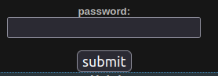
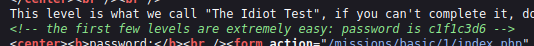

# Mission 1

## Task description
This level is what we call "The Idiot Test", if you can't complete it, don't give up on learning all you can, but, don't go begging to someone else for the answer, thats one way to get you hated/made fun of. Enter the password and you can continue.

  

## Answer
The password is in the code of the site. Select `View page source`
(or use the keyboard shortcut `Ctrl + U`) and look for the comment in which the password is written.

  

