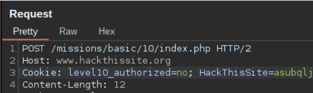
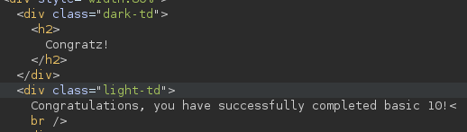

# Mission 10

## Task description
This time Sam used a more temporary and "hidden" approach to authenticating users, but he didn't think about whether or not those users knew their way around javascript...

## Answer
After seeing a page where there is only a field to enter a password in the first place, I decided to check the site code. I didn't find anything there to help find the password, so my next step was to fire up Burp Suite and trace the requests being sent.

After entering random text as a password and tracing the sent request, I found the following passage in it:

  

I sent this request to the Repeater, where I changed the value of `level10_authorized` from `no` to `yes` . After sending the modified request, a status of `200 OK` was returned, as well as information that the mission 10 was passed:

  

