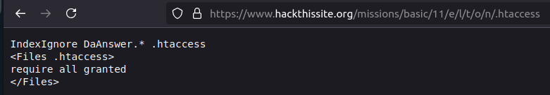
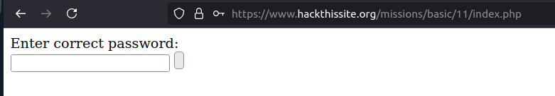

# Mission 11

## Task description
Sam decided to make a music site. Unfortunately he does not understand Apache. This mission is a bit harder than the other basics.

## Answer

When the task page was opened, a message appeared: 'I love my music! “January “ is the best!'. After refreshing the page a few times, I noticed that the song titles were changing. I decided to use the dirb tool to look for some subdirectories that would lighten the situation. So I executed `dirb https://www.hackthissite.org/missions/basic/11/ common.txt -w`

Dirb searched for a directory https://www.hackthissite.org/missions/basic/11/e/ which I decided to enter. There was another directory in it - l/. The full path after which no more additional directories showed up was https://www.hackthissite.org/missions/basic/11/e/l/t/o/n/ . The content of the write mentions that Sam does not fully understand Apache. Therefore, I decided to check access to the most common Apache directories, such as `.htaccess`, `httpd.conf` and `apache2.conf`. Typing `.htaccess` yielded the following result:

  

The next step was to check DaAnswer https://www.hackthissite.org/missions/basic/11/e/l/t/o/n/DaAnswer where the sentence “The answer is close! Just look a little harder.”
After going to https://www.hackthissite.org/missions/basic/11/index.php and entering the password, which is the word “close” I was able to complete mission 11.

  

