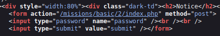

# Mission 2

## Task description
Network Security Sam set up a password protection script. He made it load the real password from an unencrypted text file and compare it to the password the user enters. However, he neglected to upload the password file...

  

## Answer
By Network Security Sam forgot to add a password file it is possible to log in without entering a password . It is sufficient to press the `Submit` button to be able to perform the action.

There is no reference to the password file in the source code:

  

