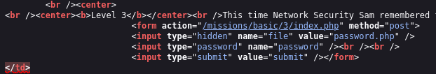
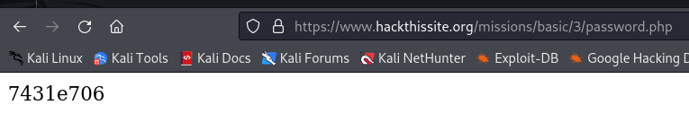

# Mission 3

## Task description
This time Network Security Sam remembered to upload the password file, but there were deeper problems than that.

  

## Answer
In order to solve this task, I again decided to look at the source code of the page where the password field is located. In it, you can spot the occurrence of the `password.php` file:

  

When I found out about the existence of this file, I decided to check access to it from the browser. I simply specified it in the URL. It turned out that both the file and the data in it were fully accessible. That's how I discovered the password.

  

