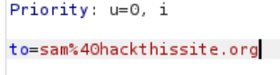
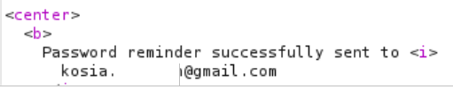
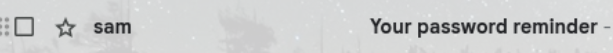

# Mission 4&5

## Task 4 description
This time Sam hardcoded the password into the script. However, the password is long and complex, and Sam is often forgetful. So he wrote a script that would email his password to him automatically in case he forgot. Here is the script:

  

## Task 5 description
Sam has gotten wise to all the people who wrote their own forms to get the password. Rather than actually learn the password, he decided to make his email program a little more secure.

## Answer to both
Burp Suite was used in solving both tasks. With it, I was able to intercept the request generated when I clicked `Send password to Sam`. In it there is a line that proves the email address to which the password is to be sent.

  

I sent this request to Repeater and changed the email address to my own. After sending the modified request, a status of `200 OK` was returned. In addition, there is the following message:

  

After accessing the mail, there was an unread message titled `Your password reminder` in which there was the password I was looking for.

  

