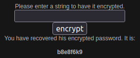
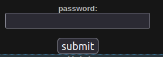

# Mission 6

## Task description
Network Security Sam has encrypted his password. The encryption system is publically available and can be accessed with this form:

  

Decrypt the password and enter it below to advance to the next level.

  

## Answer
As a first step, I decided to check how the words are encoded. As a test, I entered the 8-character word `aaaaaa`. It gave the result `abcdefgh`. It shows that the cipher works as follows:
1. first character remains the same (+0)
2. second character is shifted one forward (+1)
3. third character is shifted two forward(+2)
4. ... (+3)
5. ... (+4)
6. ... (+5)
7. ... (+6)
8. eighth character is moved seven forward (+7)

Therefore, I decided to decode the password by subtracting the corresponding values according to the logic presented above. The result looks as follows:
* b -> b (-0)
* 8 -> 7 (-1)
* e -> c (-2)
* 8 -> 5 (-3)
* f -> b (-4)
* 6 -> 1 (-5)
* k -> e (-6)
* 9 -> 2 (-7)

The resulting password is decoded: b7c5b1e2
