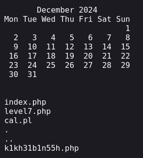

# Mission 7

## Task description
This time Network Security sam has saved the unencrypted level7 password in an obscurely named file saved in this very directory.

In other unrelated news, Sam has set up a script that returns the output from the UNIX `cal` command. Here is the script:

  

## Answer
I first tested entering the year to display the calendar. As described, the `cal` command is used, which returns a calendar. Looking at the fact that simply the result of this one command is returned, I decided to see if maybe `os.system()` was used in the python code.
As a test after the introduction of the year, I also gave the ls command like this:

  

The result of this action was the display of the calendar and the listing of the contents of the directory in which, as it turned out, is the `.php` file containing the password:

  

After specifying the file name to the path in the URL, the password was displayed.

  

