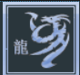
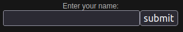
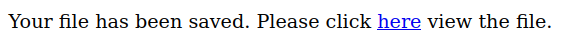
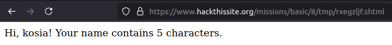
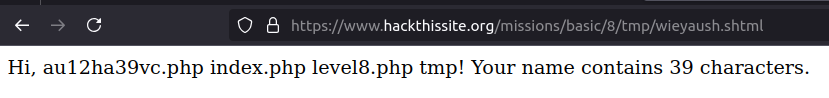
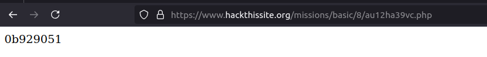

# Mission 8

## Task description
Sam remains confident that an obscured password file is still the best idea, but he screwed up with the calendar program. Sam has saved the unencrypted password file in `/var/www/hackthissite.org/html/missions/basic/8/`

However, Sam's young daughter Stephanie has just learned to program in PHP. She's talented for her age, but she knows nothing about security. She recently learned about saving files, and she wrote a script to demonstrate her ability.

  

## Answer
After typing the word in the input field, the following page is loaded:

  

After clicking on `here` we will be taken to a page containing the following message:

  

Looking at the URL at which this message is located, you can see that the saved file has the extension `.shtml`. SHTML (Server-Side Includes HTML) is a format for HTML pages that contain special instructions executed on the server side. These instructions are called Server-Side Includes (SSI). SHTML files usually have a `.shtml` extension, and the HTTP server recognizes them as pages that can contain dynamic content generated during processing on the server.

SSI instructions are special directives embedded in the HTML file, written in HTML comments.

SHTML is dangerous when it is not properly secured because it allows server-side code execution. The biggest risk is injection (injection of malicious code) when the user enters input that is directly processed as SSI directives. It is in this case that it was possible to provide `<!--#exec cmd="ls ..” -->`. The `ls ..` command allowed to list the files in the directory shown below:

  

After feeding this file into the URL, the page showed the search password:

  

