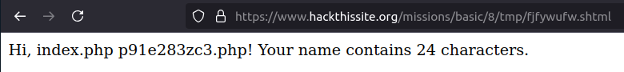
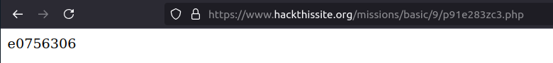

# Mission 9

## Task description
Network Security Sam is going down with the ship - he's determined to keep obscuring the password file, no matter how many times people manage to recover it. This time the file is saved in `/var/www/hackthissite.org/html/missions/basic/9/`.

In the last level, however, in my attempt to limit people to using server side includes to display the directory listing to level 8 only, I have mistakenly screwed up somewhere.. there is a way to get the obscured level 9 password. See if you can figure out how...

This level seems a lot trickier then it actually is, and it helps to have an understanding of how the script validates the user's input. The script finds the first occurance of `<--`, and looks to see what follows directly after it. 

## Answer
To solve this task, I decided to use the name input field attached in mission 8. Based on the description, I decided to enter such a command first: `<!--#exec cmd="ls ../../” -->`, which resulted in displaying the following message:

`If you are trying to use server side includes to solve the challenge, you are on the right track: but I have limited the commands allowed to ones relevant towards finding the password file for security reasons(because there will always be that one person who decides to execute some rather nasty commands). So please manipulate your code so that it is a little more pertaining to the level.`

As suggested by the author of the task, I narrowed the field and decided to look for interesting files in the directory of task 9, i.e. I executed `<!--#exec cmd="ls ../../9” -->`. In this case, it managed to list the files in the mission 9 directory:

  

After feeding this file into the URL, the page showed the search password:

  

