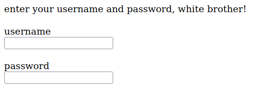
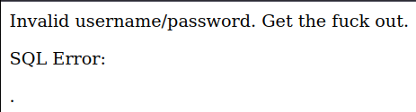

# Mission 2 - Chicago American Na*i Party

## Task description

Racist pigs are organizing an `anti-immigrant` rally in Chicago. Help anti-racist activists take over their website!

  
Full description

From: DestroyFascism

Message: I have been informed that you have quite admirable hacking skills. Well, this racist hate group is using [their website](https://www.hackthissite.org/missions/realistic/2) to organize a mass gathering of ignorant racist bastards. We cannot allow such bigoted aggression to happen. If you can gain access to their administrator page and post messages to their main page, we would be eternally grateful.

## Answer

After accessing the site and checking its source code, one finds a file `update.php` to which the path looks like this:

`
<a href="/missions/realistic/2/update.php">update</a>
 `

Once you get to the aforementioned page, the fields for logging in are displayed:

  

Having access to such fields, I decided to check whether they are susceptible to SQL Injection. It turned out that by all means they are:

  

First, I decided to try the most popular SQL Injection payload, which is the `OR 1=1` construct. After trying several combinations, I finally managed to log in correctly using `' OR 1=1;`.
