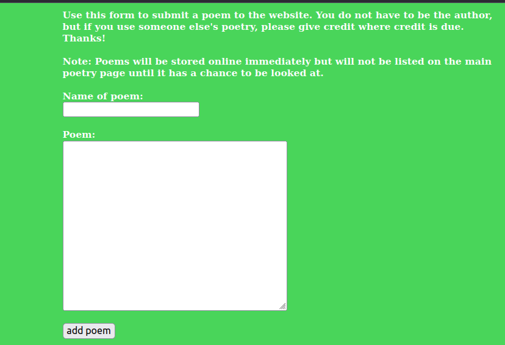
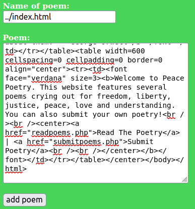

# Mission 3 - Peace Poetry: HACKED

## Task description

A little girl made a website to post poetry related to peace and understanding. American fascists have hacked this website replacing it with Hitler-esque propaganda. Can you repair the website?

  
Full description

From: PeacePoetry

Message: I run this website where people can read and submit peace-related poetry. I am doing this out of good will towards others, and I don't see why I would be making enemies out of this, but some real ass hole hacked my website posting a bunch of ignorant aggressive propaganda on the front page. And I made that website a while ago, and I no longer have access to it. Do you think you can hack in and change it back? Please? Oh, and bonus points if you message me the name of the bastard who did this!
My website can be found [here](https://www.hackthissite.org/missions/realistic/3).

## Answer

After entering `Inspect` from the browser, the following comment is visible in the HTML code:

`Note to the webmasterThis website has been hacked, but not totally destroyed. The old website is still up. I simply copied the old index.html file to oldindex.html and remade this one. Sorry about the inconvenience.`

So I decided to check what the original page looked like and what functionality it had. Accordingly, I loaded the `oldindex.html` page.

On the [Read The Poetry](https://www.hackthissite.org/missions/realistic/3/readpoem.php) page, there are poems. If you click on any of them, such as [The Idiot](https://www.hackthissite.org/missions/realistic/3/readpoem.php?name=The%20Idiot), you can read the content of the poem. The URL itself indicates that the name of the poem is in the URL as a query parameter (`?name=The%20Idiot`).

When you go to [Submit Poetry](https://www.hackthissite.org/missions/realistic/3/submitpoems.php), there is a box to add a poem to the page:

  

According to what `Note` says, the poem will be immediately stored on the server.

After reviewing both pages, you can conclude that the name of the row is also the name of the file that will be stored on the page. Therefore, in order to be able to restore the original page, it is necessary to copy the contents of `oldindex.html` and place them in the `index.html` file using the line addition form. However, be sure to specify the correct path to the file:

  

