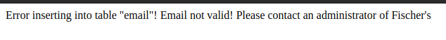
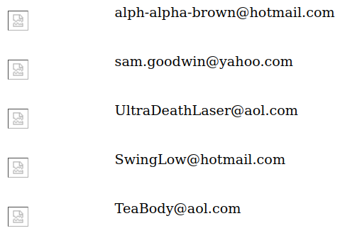

# Mission 4 - Fischer's Animal Products

## Task description

FAP is a company that slaughters animals and turns their skin into overpriced products which are then sold to rich bastards! Help animal rights activists increase political awareness by hacking their mailing list.

  
Full description

From: SaveTheWhales

Message: Hello, I was referred to you by a friend who says you know how to hack into computers and web sites - well I was wondering if you could help me out here. There's this local store who is killing hundreds of animals a day exclusively for the purpose of selling jackets and purses etc out of their skin! I have been to their website and they have an email list for their customers. I was wondering if you could somehow hack in and send me every email address on that list? I want to send them a message letting them know of the murder they are wearing. Just reply to this message with a list of the email addresses. Please? Their website is at http://www.hackthissite.org/missions/realistic/4/. Thanks so much!!

## Answer
On the home page, there is a field to enter your email address. I decided to check if this field is susceptible to SQL query injection. To do so, I used a simple `'`. This resulted in the following error:

  

This is very useful information which tells about the existence of a `email` table in the database, from where (maybe) it will be possible to extract email addresses.

I decided to take a look at the rest of the page, such as the link [Fur Coats!](https://www.hackthissite.org/missions/realistic/4/products.php?category=1), which is located at https://www.hackthissite.org/missions/realistic/4/products.php?category=1.

The page where the products are displayed has a query parameter in it (category=1).

I decided to see if this place could be a potential entry point for SQL Injection. For this purpose, I used the UNION operation which looks like this:

`?category=1 UNION SELECT null,null --`.

As no error appeared on the page, only the lack of loaded product image, I decided to check more columns. It turned out that for `?category=1 UNION SELECT null,null,null,null --` a page displays:

  

This may mean that I have to deal with four columns from which I can extract the data I am interested in. For this purpose, I decided to modify the query to the form:

`?category=1 UNION ALL SELECT null, null, null, null FROM email --`

`UNION ALL` does not remove duplicate rows, so all rows from both queries are returned, even if they are identical. This allowed me to get a broader view of the data. I executed the following queries:

1. `?category=1 UNION ALL SELECT *, null, null, null FROM email --`
2. `?category=1 UNION ALL SELECT null, *, null, null FROM email --`

The second query returned a list of email addresses:

  

To complete the task, the list of email addresses had to be copied and sent in a message to SaveTheWhales.