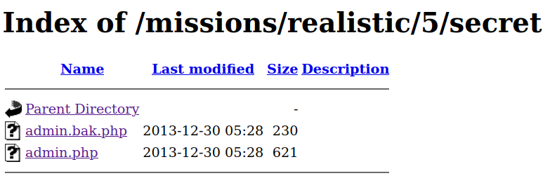
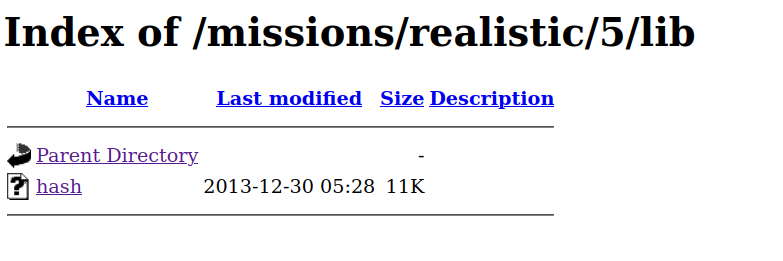
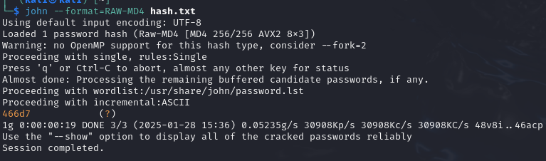
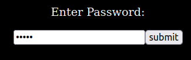

# Mission 5 - Damn Telemarketers!

## Task description

Telemarketers are invading people's privacy and peace and quiet. Get the password for the administrative section of the site to delete their database and return the privacy of their victims!

<details>
  <summary>Full description</summary>

From: spiffomatic64

Message: Yo! This is Spiffomatic64 from Hackthissite.org! I'm a bit of a hacker myself as you can see, but I recently came upon a problem I couldn't resolve.....
Lately I've been getting calls day and night from the telemarketing place. I've gone to their [website](https://www.hackthissite.org/missions/realistic/5/) and hacked it once deleting all of their phone numbers so they wouldn't call me anymore. That was a temporary fix but they put their database back up, this time with an encrypted password. When I hacked them I noticed everything they used was 10 years out of date and the new password seems to be a 'message digest'. I have done some research and I think it could be something like a so-called hash value. I think you could somehow reverse engineer it or brute force it. I also think it would be a good idea to look around the server for anything that may help you.

</details>

## Answer
After checking the source code, I decided to look at the `robots.txt` file. I found the following there:

```
User-agent: *
Disallow: /lib
Disallow: /secret
```

The first thing that caught my attention was the `/secret` folder. I found the following content there:

<p align="center">
  
</p>

The file `admin.bak.php` contained the following information: `error matching hash 906430ca24e15863add22a45adb83b19`. The most likely task will be to crack this hash to get the password for the admin panel. To gather more information I went to the `/lib` directory:

<p align="center">
  
</p>

I downloaded the `hash` file found in the directory. However, it is not fully human readable. Nevertheless, there is some information there that can help break the hash found. These include:
* `Error: MDupdate called with illegal count value %d. MD4 time trial. Processing 1 million 64-character blocks...`.
* `MD4 test suite results:`.

In both cases, MD4 is mentioned. Knowing the hash function and the hash, I could confidently start cracking the hash.

I put the hash I found in the file `hash.txt`. To be able to crack it, I decided to use the [John The Ripper](https://www.kali.org/tools/john/) tool available on Kalim Linux. I executed the following command:

```john --format=RAW-MD4 hash.txt```

Explanation of the command structure:
* `john`: launches the JTR tool,
* `-format`: Force hash of input type (supported formats can be seen with --lists=formats),
* `hash.txt`: name of hash file to be cracked.

<p align="center">
  
</p>

After I received the password, I entered it into a page that gives access to [database](https://www.hackthissite.org/missions/realistic/5/submit.html):

<p align="center">
  
</p>
