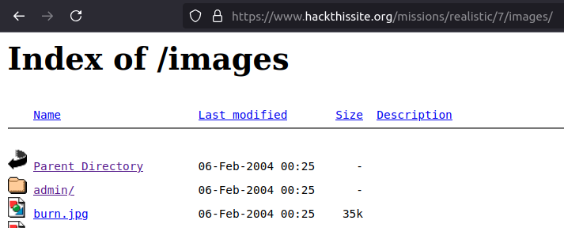
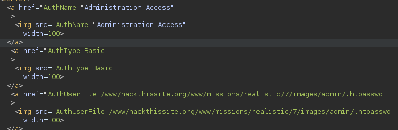
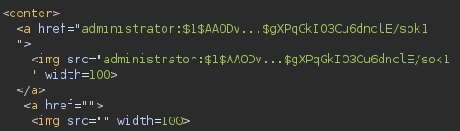
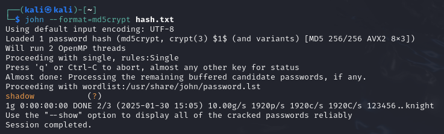

# Mission 7 - What's Right For America

## Task description

A homophobic hate group is spreading their conservative propaganda of blind obedience and bigoted war mongering. Help tolerance activists take over their website of ignorance and discrimination.

<details>
  <summary>Full description</summary>

From: FreedomOfChoice

Message: Friend of freedom and liberty, I invite you to take a look at the hate speech being spewed over the web at http://www.hackthissite.org/missions/realistic/7/. It's so funny that conservatives keep saying they want to protect the values of America - freedom, tolerance, and democracy - but when it comes to personal choices like private marijuana use or same-sex marriages, they damn them to burn in eternal hell and send them to jail.
This is a personal freedom issue. No one else is hurt if two consenting adults decide to marry. But people who claim to have the moral high ground decide to ruin it for everyone else and discriminate against same-sex couples. To think that they are talking about making a constitutional amendment to STOP OUR FREEDOM TO MARRY is ludicrous. This injustice must be stopped.
There is an admin section on that website somewhere, perhaps hidden among their directory structure. It would be a great fight against moral tyranny and a victory for freedom if you could somehow hack into their website. Thank you.

</details>

## Answer
The first thing I did was to familiarize myself with the site. Going through the various tabs, I noticed this syntax of the URL: `https://www.hackthissite.org/missions/realistic/7/showimages.php?file=patriot.txt`. There is a chance that using this query parameter can be used to pull data from inaccessible files.

While checking the code of the page, I noticed that the images are located in the `images/` directory. I decided to check its contents.

<p align="center">
  
</p>

The `admin/` directory is located there. When you try to enter it, you are prompted to log into the site. Searching the Internet, I came across information that it is possible to password-protect the directory using settings in `.htaccess`.

Given the information I discovered, I decided to see if it was possible to pull location information from `images/admin/.htaccess` using a query parameter. To carry out this plan, I used Burp Suite.

After catching the request and sending it to the Repeater, I modified the request as follows:

```
GET /missions/realistic/7/showimages.php?file=images/admin/.htaccess
```

It turned out to be a hit! The result of sending such a request is the following response:

<p align="center">
  
</p>

Following this lead, I made a similar request to read the contents of the `.htpasswd` file. The response revealed the contents of the file:

<p align="center">
  
</p>

As I know [user credentials are stored on separate lines, with each line containing a username and password separated by a colon (:)](https://www.hostwinds.com/tutorials/create-use-htpasswd). Additionally I know that [usernames are stored in plain text but passwords are stored in an encrypted hashed format. This encryption is usually MD5](https://www.hostwinds.com/tutorials/create-use-htpasswd). In this case, it remained to crack the hashed password. For this, I used the John the Ripper tool. The password was encrypted using the MD5 algorithm with salt (`crypt(3)` format). Checking the `crypt(3)` documentation, I found out what `$1$` is: [If salt is a character string starting with the characters “$id$” followed by a string optionally terminated by “$”](https://man7.org/linux/man-pages/man3/crypt.3.html)

Using the command
```
john --format=md5crypt hash.txt
```
I was able to crack the hash and extract the password:

<p align="center">
  
</p>

After entering `administrator:shadow` on `https://www.hackthissite.org/missions/realistic/7/images/admin`, I was able to log in and complete the task.
