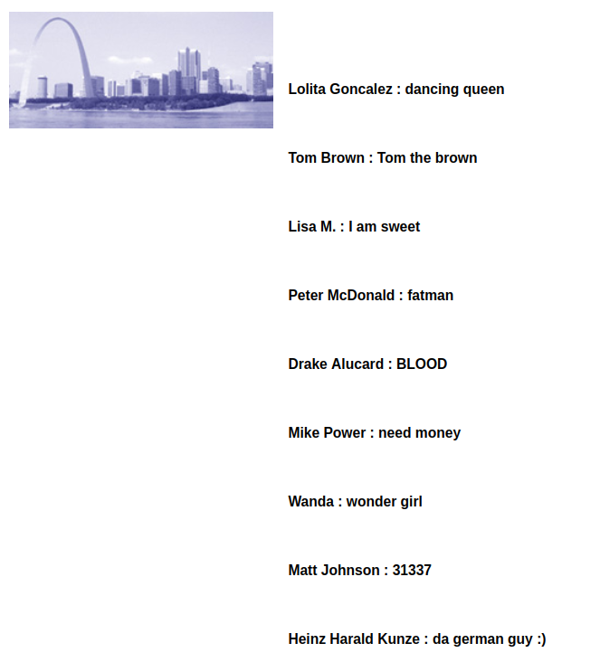
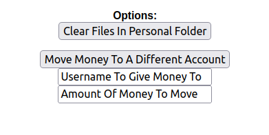
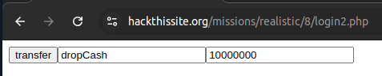

# Mission 8 - United Banks Of America

## Task description

One of America's Richest Men plans to donate $10,000,000 to a campaign set on hunting down hackers and locking them up. Please, if you can't do this, then we're all screwed. Can you hack in and move the money?

<details>
  <summary>Full description</summary>


From: DarkOneWithANeed

Message: Hey man, you gotta help me out, Gary Hunter, one of the richest men in America, has just deposited $10,000,000 into his bank account at the United Banks Of America and plans to donate that money to a campaign to hunt down and lock up all hackers. Now I've tried hacking [their site](https://www.hackthissite.org/missions/realistic/8) but I'm just not good enough. That's why I need your help, Here's a list of your objectives:
1. Find the account of Gary Hunter (I don't know his account name).
2. Move the $10,000,000 into the account `dropCash`.
3. Clear The Logs, They're held in the folder `logFiles`.
I really hope you can do this, because if you can't we're all screwed

</details>

## Answer

I first familiarized myself with the site. My attention was drawn to the form contained in the `User Info` tab. After typing `'` an error ` Error Getting Username Information From Table 'users'` is displayed. This indicates that there is a SQL Injection vulnerability. So I decided to try the classic query, i.e.

``` OR 1=1;--```

This resulted in displaying a list of users:

<p align="center">
  
</p>

There is a user there named `GaryWilliamHunter` which may point to the wanted Gary Hunter described in the task.

The next step was to create my own account to investigate what functionalities are then available.

After logging in, I was taken to the account page, where there are buttons responsible for clearing files in the personal directory and sending money to another account.

<p align="center">
  
</p>

W In connection with this, I looked at how the code of the site looks like. I found the following form there:

```
<form action='movemoney.php' method='POST'><input type='submit' value='Move Money To A Different Account'><br /><input type='text' name='TO' value='Username To Give Money To'><input type='text' name='AMOUNT' value='Amount Of Money To Move'><br /></form>
```

After making sure I was able to call the JavaScript code by specifying it in the URL, I decided to use `document.write` to execute the form. To make sure that the money would be taken from the `GaryWilliamHunter` account while logged into my account I changed the value of the `userAccount` cookie from my username to `GaryWilliamHunter`. After doing so, I invoked the following command in the browser URL:

```
javascript:void(document.write('<form action=movemoney.php method=POST><input type=submit value=transfer /><input type=text name=TO value=dropCash /><input type=text name=AMOUNT value=10000000 /></form>'))
```

As a result, I was able to perform the following action:

<p align="center">
  
</p>

Thus, the money was sent to the dropCash account

<p align="center">
  
</p>


The next step is to erase the traces of the transfer. In the code of the page there is also a form responsible for cleaning files, i.e.

```
<form action='cleardir.php' method='POST'><input type='hidden' name='dir' value='kosiaSQLFiles'><input type='submit' value='Clear Files In Personal Folder'></form>
```

I decided to use the same method as in the previous action. I invoked the following command:

```
javascript:void(document.write('<form action=cleardir.php method=POST><input type=hidden name=dir value=logFiles><input type=submit value=clear></form>'))
```

After pressing the `clear` button, the logs are cleared. Thus, the task is fully completed.
